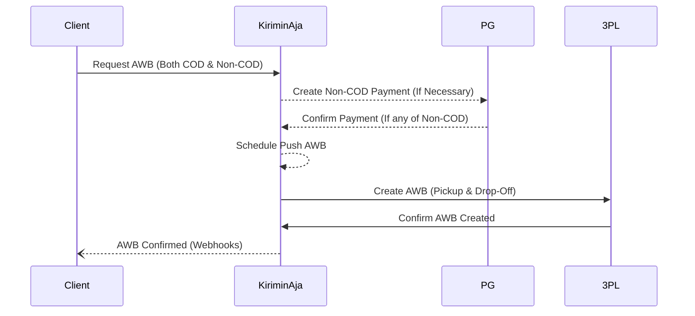

# Create Order (AWB)

The endpoint you can use to request the creation of an order, either for pickup or drop-off, through KiriminAja.

```bash
[POST] /api/mitra/v5/request_pickup
```


:::warning
**Diclaimer**: There are separate APIs for Pos Indonesia, RPX, and Paxel services. Please contact our technical team for more information.
:::

## Request
Here is the translation of the table to English:

| Field             | DataType            | Nullable      | Description                                                                                                           |
|-------------------|---------------------|-----------|-----------------------------------------------------------------------------------------------------------------------|
| ``address``       | string(min:10,max:200)| ``false`` | Full address                                                                                                          |
| ``phone``         | string(min:9,max:13)| ``false`` | Phone number using the ``0`` digit format                                                                             |
| ``name``          | string(min:1,max:50)| ``false`` | Name of the package sender                                                                                            |
| ``zipcode``       | string(max:5)       | ``true``  | Sender's postal code                                                                                                  |
| ``kecamatan_id``  | integer             | ``false`` | Sender's district ID 
| ``kelurahan_id``  | integer             | ``false`` | Sender's subdistrict ID (used when you want to use an expedition that supports the sub-district)                                                                                               |
| ``latitude``      | numeric             | ``true``  | Pickup coordinates, required for Lion and Pos Indonesia services                                                      |
| ``longitude``     | numeric             | ``true``  | Pickup coordinates, required for Lion and Pos Indonesia services                                                      |
| ``packages``      | array(min:1 object) | ``false`` | See the following package list structure                                                                              |
| ``schedule``      | string              | ``false`` | Your parcel ready estimation time. See [Schedule](./1.schedule.md). Fill with any time if your all parcel is drop-off |
| ``platform_name`` | string              | ``true``  | Your application name when receiving notifications, default is ``mitra``                                              |

### Packages Object
Here is the translation of the table to English:

| Field                        | DataType               | Nullable  | Description                                                                                 |
|------------------------------|------------------------|-----------|---------------------------------------------------------------------------------------------|
| ``order_id``                 | string(max:20)         | ``false`` | Order ID, must have a string prefix                                                         |
| ``destination_name``         | string(max:50)         | ``false`` | Recipient's name                                                                            |
| ``destination_phone``        | string(max:15)         | ``false`` | Phone number starting with the digit ``0``                                                  |
| ``destination_address``      | string(min:10,max:200) | ``false`` | Recipient's address, minimum 10 characters to avoid Bad Address pickup                      |
| ``destination_kecamatan_id`` | int                    | ``false`` | Recipient's district ID 
| ``destination_kelurahan_id`` | int                    | ``false`` | Recipient's subdistrict ID (used when you want to use an expedition that supports the sub-district)                                                                  |
| ``weight``                   | int(min:1)             | ``false`` | Package weight in ``grams``                                                                 |
| ``width``                    | int(min:1)             | ``false`` | ``cm``                                                                                      |
| ``length``                   | int(min:1)             | ``false`` | ``cm``                                                                                      |
| ``qty``                      | int                    | ``true``  | Number of items in the package, defaults to 1 if empty                                      |
| ``height``                   | int(min:1)             | ``false`` | ``cm``                                                                                      |
| ``item_value``               | int(min:1000)          | ``false`` | Total value of the items                                                                    |
| ``shipping_cost``            | int                    | ``false`` | Shipping cost, see # Shipping Price section                                                 |
| ``service``                  | string                 | ``false`` | See shipping price for this                                                                 |
| ``insurance_amount``         | numeric                | ``true``  | See [Terms & Conditions](https://kiriminaja.com/syarat-ketentuan)                           |
| ``service_type``             | string                 | ``false`` | The service type, like ``EZ``, ``REG``, ``CTC``, ``OKE``, etc. (see shipping price section) |
| ``cod``                      | int                    | ``false`` | COD PRICE ***NB: Enter 0 for non-COD packages***                                            |
| ``package_type_id``          | int                    | ``false`` | Available package type, currently ``7`` or can check at this link https://bit.ly/package_type_id                                                     |
| ``item_name``                | string(max:255)        | ``false`` | Package contents                                                                            |
| ``drop``                     | bool                   | ``true``  | DROP-OFF / CASHLESS                                                                         |
| ``note``                     | string(max:50)         | ``true``  | Special instructions                                                                        |

### Insurance & COD NB
The values for ``add_cost`` and ``insurance_amount`` are calculated according to the agreements established before the API integration process with us.

For faster pickup requests, we only verify the shipping costs at the time of driver validation rather than through the API.

| Param                     | Amount                                                                               |
|---------------------------|--------------------------------------------------------------------------------------|
| ``item_value``            | 20000                                                                                |
| ``percentage`` (from T&A) | According to 3pl (See [Terms & Conditions](https://kiriminaja.com/syarat-ketentuan)) | 
| --------                  | *******                                                                              |
| ``insurance_amount``      | ``item_value`` * ``percentage`` and rounded up to 100                                |


### COD Fee Calculation
| Param                  | Amount                                                             |
|------------------------|--------------------------------------------------------------------|
| ``item_value``         | 20000                                                              |
| ``shipping_cost``      | 15000                                                              |
| ``insurance_amount``   | 500                                                                |
| ``cod_fee`` (from T&A) | See [Terms & Conditions](https://kiriminaja.com/syarat-ketentuan)  |
| --------               | +++++++                                                            |
| ``total``              | 35500                                                              |
| ``add_cost``           | ``total`` * ``cod_fee`` and rounded up to 1 (ex : 1000,27 to 1001) |
| ``cod``                | ``total`` + ``cod_fee``                                            |

### Example
```js
{
    "address" : "Jl. Jodipati No.29 Perum Taman Kencana Sejahtera",
    "phone" : "0813334546789",
    "kecamatan_id": 548,
    "kelurahan_id" : 31487,
    "packages" : [
        {
          "order_id": "YGL-000000019",
          "destination_name": "Flag Test",
          "destination_phone": "082223323333",
          "destination_address": "Jl. Magelang KM 11",
          "destination_kecamatan_id": 548,
          "destination_kelurahan_id": 31483,
          "destination_zipcode": 55598,
          "weight": 520,
          "width": 8,
          "height": 8,
          "length": 8,
          "item_value": 275000,
          "shipping_cost": 65000,
          "service": "posindonesia",
          "service_type": "901979",
          "item_name": "TEST Item name",
          "package_type_id": 7,
          "cod": 100000
        }

    ],
    "name" : "Tokotries",
    "zipcode" : "55598",
    "schedule" : "2021-11-30 22:00:00"
}
```

## Response
```ts
{
  "status": true,
  "text": "Request pickup berhasil",
  "method": "request_pickup",
  "payment_status": "paid",
  "qr_url": "00020101021226570011ID.DANA.xxxxxxxx",
  "payment_status": "unpaid",
  "details": [
    {
      "order_id": "DEV-000000018",
      "kj_order_id": "DEV-000000018",
      "awb": null,
      "service": "posindonesia",
      "service_type": "901979"
    }
  ],
  "pickup_number": "XID-7850941654"
}
```
| Param              | DataType        | Remark                       |
|--------------------|-----------------|------------------------------|
| ``payment_status`` | Enum            | pending, paid                |
| ``details``        | Array of Object | Pickup request packages list |
| ``pickup_number``  | String          | Pickup Number / Payment ID   |
