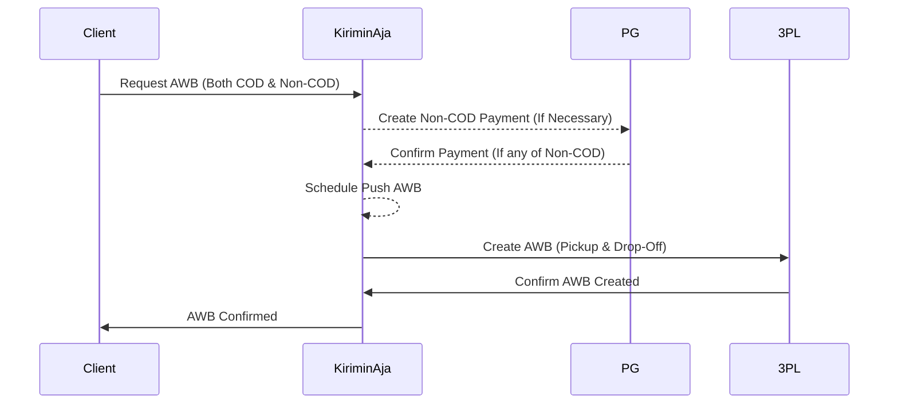

# Pickup Request

Here's how you connect to 3PL to get pickup request and also get awb for courier driver reference.




```shell
[POST] /api/mitra/v4/instant/pickup/request
```

### Body Payloads
| Payload        | Values                                         | Type            | Required |
|----------------|------------------------------------------------|-----------------|----------|
| `service`      | Courier code `grab_express`, `borzo`, `gosend` | String          | YES      |
| `service_type` | Price `result.costs.[].service_type`           | String          | YES      |
| `vehicle`      | motor, mobil                                   | String          | YES      |
| `order_prefix` | Your seller order Prefix                       | String          | YES      |
| `packages`     | Packages Object                                | Array of Object | YES      |


### Packages Object
| Payload                    | Values                                                                             | Type      | Required |
|----------------------------|------------------------------------------------------------------------------------|-----------|----------|
| `order_id`                 | Order ID or Reference No                                                           | `string`  | YES      |
| `origin_name`              | Sender Name                                                                        | `string`  | YES      |
| `origin_phone`             | Sender Phone Number, use a country phone scope                                     | `string`  | YES      |
| `origin_lat`               | Sender Origin Latitude                                                             | `float`   | YES      |
| `origin_long`              | Sender Origin Longitude                                                            | `float`   | YES      |
| `origin_address`           | Sender Origin Address Detail                                                       | `string`  | YES      |
| `origin_address_note`      | Sender Origin Address Detail Note e.g "Dekat Kantor"                               | `string`  | YES      |
| `destination_name`         | Receiver Name                                                                      | `string`  | YES      |
| `destination_phone`        | Receiver Phone Number, use a country phone scope                                   | `string`  | YES      |
| `destination_lat`          | Receiver Origin Latitude                                                           | `float`   | YES      |
| `destination_long`         | Receiver Origin Longitude                                                          | `float`   | YES      |
| `destination_address`      | Receiver Origin Address Detail                                                     | `string`  | YES      |
| `destination_address_note` | Receiver Origin Address Detail Note e.g "Dekat Kantor"                             | `string`  | YES      |
| `shipping_price`           | Your shipping cost value, we use for validation                                    | `int`     | YES      |
| `item`                     | Item detail                                                                        | `object`  | YES      |

### Item Object
| Payload       | Values                                                                                   | Type     | Required |
|---------------|------------------------------------------------------------------------------------------|----------|----------|
| `name`        | The item name                                                                            | `string` | YES      |
| `description` | The item description                                                                     | `string` | YES      |
| `price`       | Your goods value for insurance purpose                                                   | `int`    | YES      |
| `weight_kg`   | Weight for the package in KG. Please use volumetric if higher volumetric value detected. | `int`    | YES      |


## Request Example
```shell
curl --location 'https://tdev.kiriminaja.com/api/mitra/v4/instant/pickup/request' \
--header 'Accept: application/json' \
--header 'Content-Type: application/json' \
--header 'Authorization: Bearer {token}' \
--data '
{
    "service" : "gosend",
    "service_type" : "instant",
    "vehicle" : "motor",
    "order_prefix" : "NBL2",
    "packages" : [
        {
            "destination_name" : "Arfian",
            "destination_phone" : "081280045616",
            "destination_lat" : -7.734943400000001,
            "destination_long" : 110.405355,
            "destination_address" : "Minomartani, Kec. Ngaglik, Kabupaten Sleman, Daerah Istimewa Yogyakarta, Indonesia",
            "destination_address_note" : "Tidak Ada Destination",
            "origin_name" : "Arfian",
            "origin_phone" : "081280045616",
            "origin_lat" : -7.8032616,
            "origin_long" : 110.350244,
            "origin_address" : "Wirobrajan, Kota Yogyakarta, Daerah Istimewa Yogyakarta, Indonesia",
            "origin_address_note" : "Tidak Ada Origin",
            "shipping_price" : 34000,
            "item" : {
                "name" : "Barang 1",
                "description" : "Barang 1 Description",
                "price" : 20000,
                "weight_kg" : 2
            }
        }
    ]
}'
```

### Response Example
```js
{
    "status": true,
    "text": "success",
    "code": 0,
    "method": null,
    "result": {
        "payment": {
            "payment_id": "PID-1705636897",
            "amount": 35000,
            "status_code": "Billing siap dibayar",
            "qr_content": "some-random-qr-string",
            "pay_time": "2024-01-19T04:01:38.450035Z"
        },
        "packages": [
            {
                "awb": "",
                "order_id": "NBL2-1705636897084",
                "service": "gosend",
                "service_type": "instant",
                "status": 100,
                "live_track_url": null,
                "poly_line": "jasn@_xo`TPwD@WwEm@iDa@mFo@a@M}K{AgEe@wAQmEi@y@MyBSwBWiC[iCSaGw@qAKmCOKAFwALqBCmAWwAw@}BeAqC_@gAqCKaAEUIKu@o@sCUo@Wg@c@s@GAIIGKAEk@_@g@YsBeAaEkB[Iu@EsGIiCE}@@wEEyFK_KUkQYyJQsIMmUe@iEE}JQ}FKuXe@oP[oLOqEK}KKsEGeAC{AC_BCGPQRMBI?QCOKCGEQBQFOLGVw@`@_AjA_Ej@wBTc@l@aERgDP{BJsD`@eGh@cEj@cE`@qERoAf@yEx@iHHiA@o@IyAIsAEi@EeADmAB_@\\eBBOICXuAr@qC^aAd@kAjAmC`AwBj@_AbAwAb@g@dA{@Dc@ASGQOKeAq@sAm@w@e@{GcDaAa@eAk@eAg@kAk@mHqD_CgAkBaAgD}AeG_DmFoCgAa@gAe@eDeBwDoByAs@mB_AsAq@{CyAsAq@uAu@eIcE{EcCuBaAkBy@iDcBqB_AcD}AmB{@gEsB_Ak@_Bu@KEf@cANY`CiFr@mAZs@?MIo@Bk@PoAJa@BMFMTSPMPQ^]^g@B[DkALyCDg@L@f@BbDD|@?pBDv@BAg@C}@G]E_ADOn@k@DuAHu@@KqAMWCB[",
                "origin": {
                    "name": "Arfian",
                    "address": "Wirobrajan, Kota Yogyakarta, Daerah Istimewa Yogyakarta, Indonesia",
                    "phone": "081280045616",
                    "lat_long": "-7.8032616,110.350244"
                },
                "destination": {
                    "name": "Arfian",
                    "address": "Minomartani, Kec. Ngaglik, Kabupaten Sleman, Daerah Istimewa Yogyakarta, Indonesia",
                    "phone": "081280045616",
                    "lat_long": "-7.7349434,110.405355"
                },
                "driver": {
                    "name": null,
                    "phone": null,
                    "image": null
                }
            }
        ]
    }
}
```
### Response Example – Error
```json
{
    "status": false,
    "text": "cannot process the request, distance more than 40km",
    "code": 2,
    "method": null,
    "result": null
}
```
