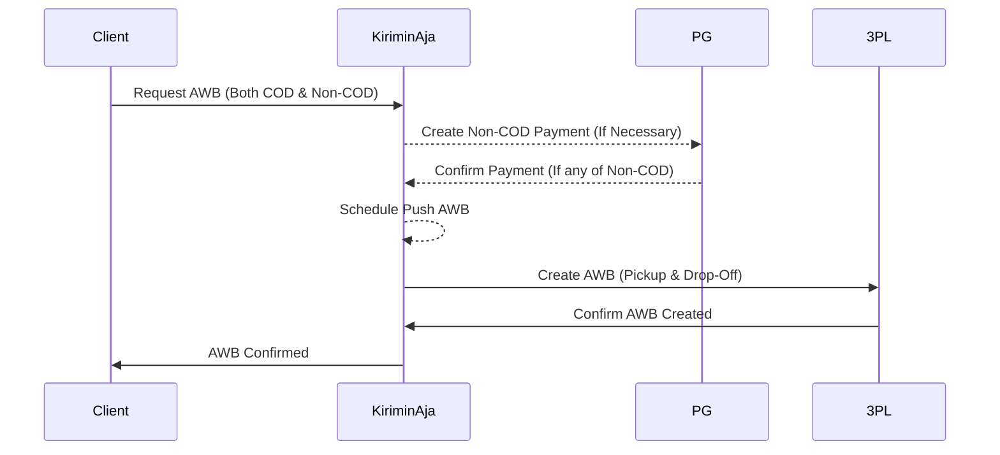

# Pickup Request

Here's how you connect to 3PL to get pickup request and also get awb for courier driver reference.



```shell
[POST] /api/mitra/v4/instant/pickup/request
```

## Payload

| Payload        | Values                                                      | Type            | Required |
| -------------- | ----------------------------------------------------------- | --------------- | -------- |
| `service`      | Courier code `grab_express`, `borzo`, `gosend`              | String          | YES      |
| `service_type` | Price `result.costs.[].service_type`                        | String          | YES      |
| `vehicle`      | `motor` (Bike) or `mobil` (Car)                             | String          | YES      |
| `order_prefix` | Your seller order Prefix, we will use for generate order id | String          | YES      |
| `packages`     | Packages Object                                             | Array of Object | YES      |

### Packages Object

| Payload                    | Values                                                 | Type     | Required |
| -------------------------- | ------------------------------------------------------ | -------- | -------- |
| `origin_name`              | Sender Name                                            | `string` | YES      |
| `origin_phone`             | Sender Phone Number, use a country phone scope         | `string` | YES      |
| `origin_lat`               | Sender Origin Latitude                                 | `float`  | YES      |
| `origin_long`              | Sender Origin Longitude                                | `float`  | YES      |
| `origin_address`           | Sender Origin Address Detail                           | `string` | YES      |
| `origin_address_note`      | Sender Origin Address Detail Note e.g "Dekat Kantor"   | `string` | YES      |
| `destination_name`         | Receiver Name                                          | `string` | YES      |
| `destination_phone`        | Receiver Phone Number, use a country phone scope       | `string` | YES      |
| `destination_lat`          | Receiver Origin Latitude                               | `float`  | YES      |
| `destination_long`         | Receiver Origin Longitude                              | `float`  | YES      |
| `destination_address`      | Receiver Origin Address Detail                         | `string` | YES      |
| `destination_address_note` | Receiver Origin Address Detail Note e.g "Dekat Kantor" | `string` | YES      |
| `shipping_price`           | Your shipping cost value, we use for validation        | `int`    | YES      |
| `item`                     | Item detail                                            | `object` | YES      |

### Item Object

| Payload       | Values                                                                                   | Type     | Required |
| ------------- | ---------------------------------------------------------------------------------------- | -------- | -------- |
| `name`        | The item name                                                                            | `string` | YES      |
| `description` | The item description                                                                     | `string` | YES      |
| `price`       | Your goods value for insurance purpose                                                   | `int`    | YES      |
| `weight_kg`   | Weight for the package in KG. Please use volumetric if higher volumetric value detected. | `int`    | YES      |

### Example

```json
{
  "service": "gosend",

  "service_type": "instant",

  "vehicle": "motor",

  "order_prefix": "BDI",

  "packages": [
    {
      "destination_name": "Okka Syahputra",

      "destination_phone": "081280045616",

      "destination_lat": -7.776192418965594,

      "destination_long": 110.32505379554323,

      "destination_address": "Godean, Sidoarum, Sleman",

      "destination_address_note": "Tidak Ada Destination",

      "origin_name": "Rizky Syahputra",

      "origin_phone": "081280045616",

      "origin_lat": -7.854584796417944,

      "origin_long": 110.33115444430031,

      "origin_address": "Wirobrajan, Kota Yogyakarta, Daerah Istimewa Yogyakarta, Indonesia",

      "origin_address_note": "Tidak Ada Origin",

      "shipping_price": 34000,

      "item": {
        "name": "Barang 1",

        "description": "Barang 1 Description",

        "price": 20000,

        "weight": 1000
      }
    }
  ]
}
```

### Response

```json
{
  "status": true,
  "text": "waiting for driver",
  "code": 0,
  "method": null,
  "result": {
    "payment": {
      "payment_id": "PID-1736406074",
      "amount": 34000,
      "status_code": "Pembayaran berhasil",
      "qr_content": null,
      "pay_time": null
    },
    "packages": [
      {
        "awb": "GK-11-3177494",
        "order_id": "NBL2-1705636897084",
        "service": "gosend",
        "service_type": "instant",
        "status": 105,
        "live_track_url": null,
        "poly_line": "jasn@_xo`TPwD@WwEm@iDa@mFo@a@M}K{AgEe@wAQmEi@y@MyBSwBWiC[iCSaGw@qAKmCOKAFwALqBCmAWwAw@}BeAqC_@gAqCKaAEUIKu@o@sCUo@Wg@c@s@GAIIGKAEk@_@g@YsBeAaEkB[Iu@EsGIiCE}@@wEEyFK_KUkQYyJQsIMmUe@iEE}JQ}FKuXe@oP[oLOqEK}KKsEGeAC{AC_BCGPQRMBI?QCOKCGEQBQFOLGVw@`@_AjA_Ej@wBTc@l@aERgDP{BJsD`@eGh@cEj@cE`@qERoAf@yEx@iHHiA@o@IyAIsAEi@EeADmAB_@\\eBBOICXuAr@qC^aAd@kAjAmC`AwBj@_AbAwAb@g@dA{@Dc@ASGQOKeAq@sAm@w@e@{GcDaAa@eAk@eAg@kAk@mHqD_CgAkBaAgD}AeG_DmFoCgAa@gAe@eDeBwDoByAs@mB_AsAq@{CyAsAq@uAu@eIcE{EcCuBaAkBy@iDcBqB_AcD}AmB{@gEsB_Ak@_Bu@KEf@cANY`CiFr@mAZs@?MIo@Bk@PoAJa@BMFMTSPMPQ^]^g@B[DkALyCDg@L@f@BbDD|@?pBDv@BAg@C}@G]E_ADOn@k@DuAHu@@KqAMWCB[",
        "origin": {
          "name": "Arfian",
          "address": "Wirobrajan, Kota Yogyakarta, Daerah Istimewa Yogyakarta, Indonesia",
          "phone": "081280045616",
          "lat_long": "-7.8032616,110.350244"
        },
        "destination": {
          "name": "Arfian",
          "address": "Minomartani, Kec. Ngaglik, Kabupaten Sleman, Daerah Istimewa Yogyakarta, Indonesia",
          "phone": "081280045616",
          "lat_long": "-7.7349434,110.405355"
        },
        "driver": {
          "name": null,
          "phone": null,
          "image": null
        }
      }
    ]
  }
}
```

### Response – Error

```json
{
  "status": false,
  "text": "cannot process the request, distance more than 40km",
  "code": 2,
  "method": null,
  "result": null
}
```