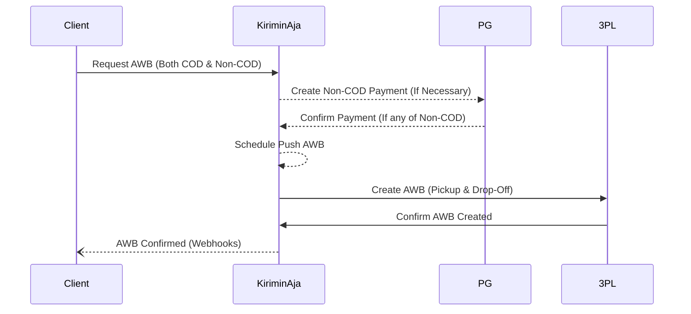

# Get Payment

Get the QRIS code token for yor app, you need this api if you're not Term of Payment member.

```shell
[POST] /api/mitra/v2/get_payment
```



## Request
| Field          | DataType | Nullable  | Desc                           |
|----------------|----------|-----------|--------------------------------|
| ``payment_id`` | string   | ``false`` | The pickup number / payment id |

## Response
### Express
```js
{
  "status": true,
  "text": "Success",
  "method": "payment",
  "data": {
    "payment_id": "XID-5732095327",
    "qr_content": "XXX",
    "method": "08",
    "pay_time": "20210712103644",
    "status": "Billing berhasil dibuat",
    "status_code": "9",
    "amount": 65000,
    "paid_at": null,
    "created_at": "2021-07-12T03:35:42.000000Z"
  }
}
```

### Instant
```js
{
	"status": true,
	"text": "get_payment",
	"method": null,
	"result": {
		"payment_id": "PID-1683603627",
		"amount": 54000,
		"status_code": 0,
		"qr_content": null,
		"pay_time": null,
		"packages": [
			{
				"awb": "GK-11-2239895",
				"order_id": "YAN-1683603626755",
				"service": "gosend",
				"service_name": "instant",
				"status": 105,
				"live_track_url": null,
				"origin": {
					"name": "sopo jei aku ra ngerti",
					"address": "Kawasan Mega Kuningan, Jalan Dr Ide Anak Agung Gde Agung Kav E.1.2 No 1&2, Jakarta, 12950",
					"phone": "08967872837",
					"latitude": -6.2184034,
					"longitude": 106.8276737
				},
				"destination": {
					"name": "sopo jei aku ra ngerti",
					"address": "Jl. Jenderal Sudirman No.45 - 46, RT.3\/RW.4, Karet Semanggi, Kecamatan Setiabudi, Kota Jakarta Selatan, Daerah Khusus Ibukota Jakarta 12930",
					"phone": "08967872837",
					"latitude": -6.1599934,
					"longitude": 106.6872187
				}
			}
		]
	},
	"code": null
}
```

### Explain
| Field | DataType  | Desc |
| ------ |-----------| ------ |
| ``data`` | Object    | Payment inquiry result |
| ``method`` | String    | KA Identifier |
| ``pay_time`` | String    | KA Identifier |
| ``qr_content`` | String    | Kode QR yang perlu anda lakukan generate kedalam bentuk QR code |
| ``status`` | String    | Status labeling |
| ``status_code`` | String    | 9 = unpaid, 0 = paid |
| ``paid_at`` | Timestamp | Akan terisi ketika berhasil dibayar |
| ``created_at`` | Timestamp | Tanggal pembayaran dibuat (UTC+7) |
