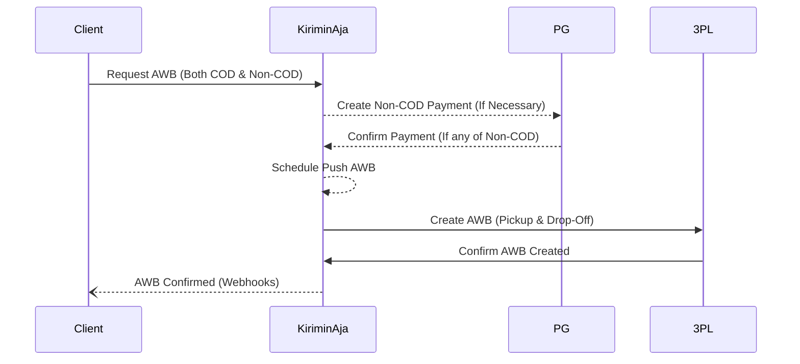

import DocCardList from '@theme/DocCardList'
import { useCurrentSidebarCategory } from '@docusaurus/theme-common'

# Instant Delivery

This payment API is essential for users whose accounts are not registered as TOP (Term of Payment) members. If you are a TOP member, you can bypass this step and proceed directly to creating an AWB (Air Waybill) request seamlessly. This ensures a smoother and more efficient process for managing your shipments.

:::info
For Term of Payment member you will not required to pay any amount while triggering request awb. Our callbacks will automatically scheduled (mark as paid)
:::

<DocCardList items={useCurrentSidebarCategory().items} />
